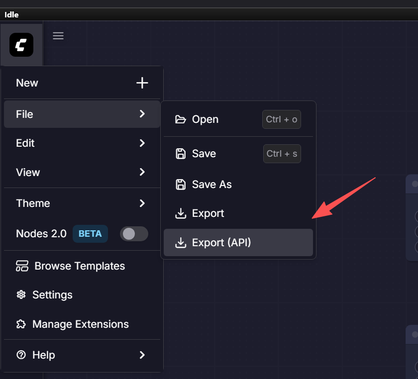
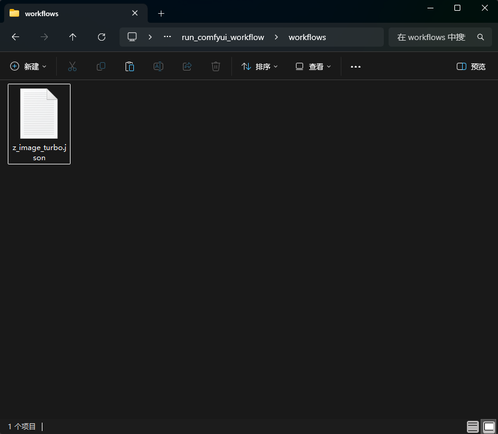
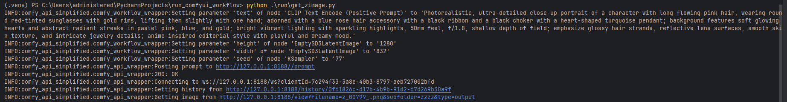
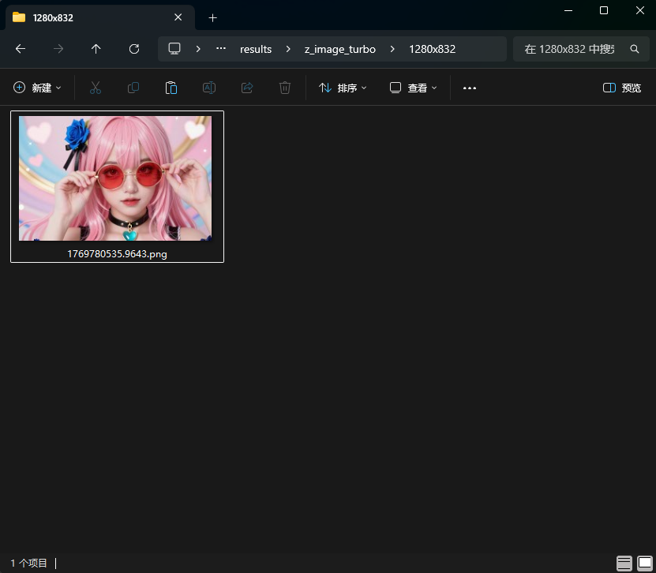
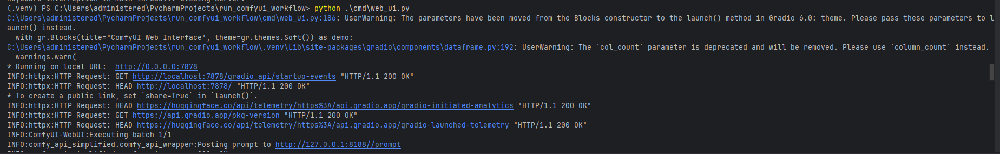
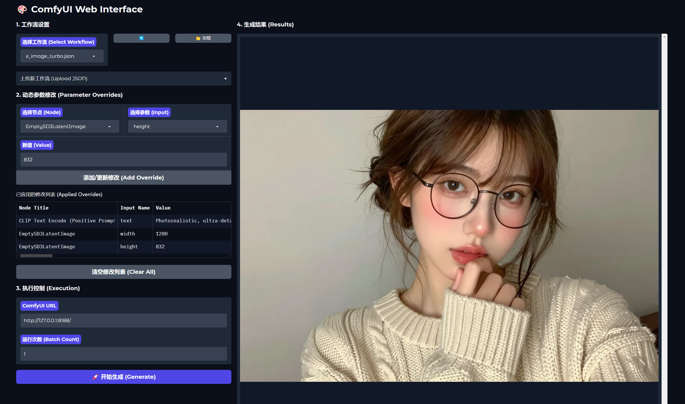

# Run ComfyUI Workflow


[中文](README.md) | [English](README_EN.md)

本项目旨在通过 Python 脚本方便地调用和运行 ComfyUI 工作流。它提供了一个简化的 API 包装器，允许用户加载 ComfyUI 的 API 格式工作流，动态修改参数（如提示词、种子、图像尺寸等），并获取生成结果。

> **说明**：本项目为了方便使用，直接集成了 [comfy_api_simplified](https://github.com/deimos-deimos/comfy_api_simplified) 的核心代码，并进行了部分修改。感谢原作者 [deimos-deimos](https://github.com/deimos-deimos) 以及所有贡献者（本项目作者也曾参与贡献了原项目的部分代码）。

## 目录结构

- `comfy_api_simplified/`: 核心 API 包装库。
- `workflows/`: 存放 ComfyUI 导出的 API 格式工作流文件（.json）。
- `run/`: 存放运行脚本，用于加载工作流并执行任务。
- `cmd/`: 存放命令行工具和 Web UI 启动脚本。
- `results/`: 默认的结果输出目录。

## 🚀 快速开始

### 1. 环境准备

确保你已经安装了 Python 3.x。建议使用虚拟环境。

```bash
# Windows
.\.venv\Scripts\activate

# Linux/macOS
source .venv/bin/activate
```

### 2. 安装依赖

本项目包含一个 `pyproject.toml` 文件，你可以直接安装本项目及其依赖：

```bash
pip install -e .
```

或者手动安装所需的第三方库：

```bash
pip install requests websockets gradio pillow
```

## 📖 使用方法

### 方法一：Python 代码运行

适合开发者，可以灵活编写逻辑进行批量生成或自动化测试。

#### 1. 导出 API 工作流

1. 打开 ComfyUI 网页界面。
2. 点击设置（齿轮图标），勾选 **"Enable Dev mode Options"**。
3. 点击菜单栏的 **"Save (API Format)"** 按钮，将工作流保存为 JSON 文件。



#### 2. 放置工作流文件

将导出的 JSON 文件放置在项目的 `workflows/` 目录下。



#### 3. 编写运行脚本

参考 `run/get_zimage.py`，新建一个 Python 脚本。

```python
from comfy_api_simplified import ComfyApiWrapper, ComfyWorkflowWrapper

api = ComfyApiWrapper("http://127.0.0.1:8188/")
wf = ComfyWorkflowWrapper("workflows/your_workflow.json")

# 修改参数
wf.set_node_param("KSampler", "seed", 12345)

# 运行并保存
results = api.queue_and_wait_images(wf, output_node_title="Save Image")
# ... 保存逻辑 ...
```

#### 4. 运行并检查结果

在终端运行脚本：

```bash
python run/your_script.py
```

结果将保存在 `results/` 目录下。




---

### 方法二：Web 界面 (Gradio)

无需编写代码，通过可视化界面直接运行和调试工作流。

#### 1. 启动 Web UI

执行以下命令启动界面：

```bash
python cmd/web_ui.py
```

界面将在 **http://127.0.0.1:7878** 启动。



#### 2. 设置参数并运行

1. **选择工作流**：在下拉菜单中选择，或上传新的 JSON 文件。
2. **加载参数**：点击“加载”按钮，读取工作流节点信息。
3. **修改参数**：选择节点和参数，输入新值并点击“添加/更新修改”。
4. **开始生成**：设置运行次数，点击“开始生成”。结果将实时显示在右侧画廊中。



## 常用功能

- **修改节点参数**：使用 `wf.set_node_param(node_title, param_name, value)`。
- **提交任务**：使用 `api.queue_and_wait_images(wf, output_node_title="Save Image")`。

## 注意事项

- 导出的工作流必须是 **API Format**，而不是普通的 Save。
- 脚本中的节点标题（如 "KSampler", "Save Image"）必须与 ComfyUI 中的节点标题完全一致。
